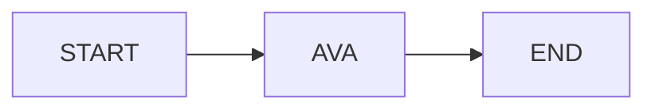

# Mô hình ví dụ: AVA Chatbot với LangGraph

Ví dụ này minh họa cách xây dựng một agent hội thoại cơ bản sử dụng LangGraph.

## Mô hình tổng quát

- Sử dụng LangGraph để tạo một agent hội thoại một node.
- Graph gồm 3 bước:
    - **START** → **AVA** → **END**
- Node "AVA" đại diện cho agent, nhận trạng thái hội thoại (các tin nhắn) và sinh phản hồi mới bằng LLM.
- Trạng thái (State) lưu trữ toàn bộ lịch sử tin nhắn giữa người dùng và agent trong mỗi lượt hội thoại.
- Mỗi lần người dùng nhập câu hỏi, graph được kích hoạt lại với trạng thái mới, đảm bảo agent có thể truy cập lịch sử hội thoại.

## Mục đích

- Là ví dụ tối giản để đào tạo cách sử dụng LangGraph xây dựng agent hội thoại.
- Dễ dàng mở rộng thêm node hoặc logic phức tạp hơn.
