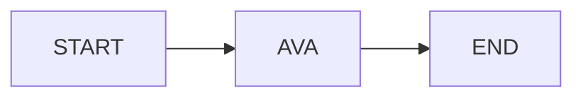

# Mô hình ví dụ: AVA Chatbot với LangGraph và bộ nhớ hội thoại

Ví dụ này mở rộng từ ví dụ 1, bổ sung khả năng lưu trữ trạng thái hội thoại (memory) cho agent.

## Mô hình tổng quát

- Sử dụng LangGraph để tạo agent hội thoại một node.
- Tích hợp `MemorySaver` để lưu lại trạng thái (State) của graph giữa các lượt hội thoại.
- Graph gồm 3 bước:
    - **START** → **AVA** → **END**
- Node "AVA" nhận trạng thái hội thoại, sinh phản hồi mới bằng LLM, và trạng thái này được lưu lại qua nhiều phiên làm việc nhờ memory backend.
- Khi triển khai thực tế, có thể thay thế MemorySaver bằng Redis hoặc MongoDB để lưu trữ trạng thái bền vững.

## Mục đích

- Minh họa cách mở rộng agent LangGraph với khả năng ghi nhớ hội thoại lâu dài.
- Phù hợp cho các ứng dụng chatbot thực tế cần lưu lịch sử hội thoại giữa các phiên làm việc.
