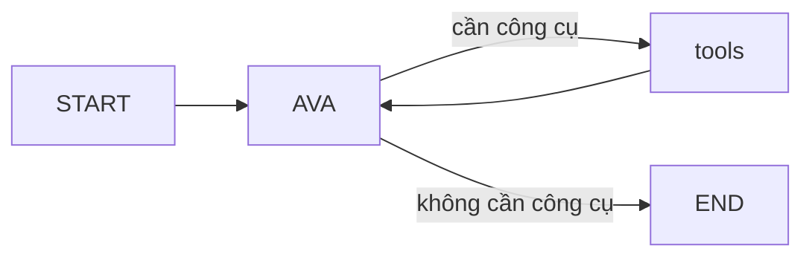

# Mô hình ví dụ: AVA Agent với LangGraph và Tools

Ví dụ này mở rộng từ các ví dụ trước, tạo ra một agent tiên tiến có khả năng sử dụng công cụ bên ngoài (tools) để trả lời câu hỏi người dùng.

## Mô hình tổng quát

- Tích hợp công cụ `GetGoldAndWeather` để truy xuất thông tin thời tiết và giá vàng từ API ngoài.
- Sử dụng `StateGraph` kết hợp với `ToolNode` để tạo cấu trúc graph phức tạp hơn với chu trình ra quyết định.
- Tích hợp `MemorySaver` để lưu lại trạng thái (State) của graph giữa các lượt hội thoại.
- Sử dụng edge có điều kiện để quyết định flow của agent dựa trên phân tích câu hỏi.

## Cấu trúc Graph

- **Node "AVA"**: Xử lý tin nhắn người dùng và quyết định cần sử dụng công cụ hay không
- **Node "tools"**: Thực hiện việc gọi API và trả kết quả về node AVA
- **Edge có điều kiện**: Dựa vào việc AVA có yêu cầu gọi công cụ không để định tuyến luồng xử lý

## Quy trình xử lý

1. Người dùng nhập câu hỏi
2. Node AVA phân tích và quyết định có cần sử dụng công cụ không
3. Nếu cần, chuyển sang node tools để lấy thông tin
4. Node tools trả kết quả về AVA để tổng hợp phản hồi cuối cùng
5. AVA trả lời người dùng

## Mục đích

- Minh họa cách xây dựng agent phức tạp có khả năng sử dụng công cụ bên ngoài.
- Phù hợp cho các ứng dụng thực tế cần tương tác với API hoặc dữ liệu từ bên ngoài.
- Thiết kế linh hoạt cho phép dễ dàng mở rộng thêm nhiều công cụ khác.
